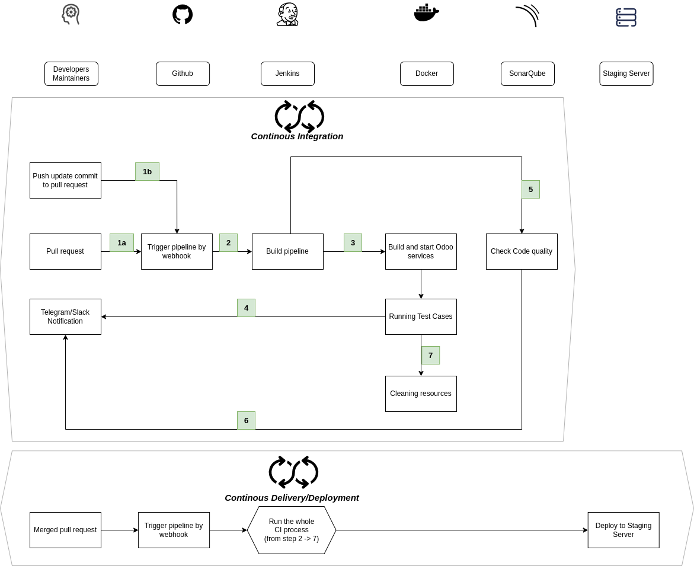

# Setup

1.  Install Jenkins using docker

    1.1. [Install Docker & Docker compose](https://docs.docker.com/engine/install/)

    1.2. Execute bash script to create Jenkins data folder

    ```shell
        sudo ./jenkins-docker-compose/host-setup.sh
    ```

    1.3. Run Jenkins

    ```shell
        cd jenkins-docker-compose
        docker compose up -d --build
    ```

2.  Allow Jenkins connect to Github using SSH keys

    2.1. Add SSH keys to Jenkins instance

    -   Access to Jenkins instance

    -   [Generating SSH keys or find the keys that already exists](https://docs.github.com/en/authentication/connecting-to-github-with-ssh/generating-a-new-ssh-key-and-adding-it-to-the-ssh-agent#generating-a-new-ssh-key)

    -   [Adding SSH keys to ssh-agent](https://docs.github.com/en/authentication/connecting-to-github-with-ssh/generating-a-new-ssh-key-and-adding-it-to-the-ssh-agent#adding-your-ssh-key-to-the-ssh-agent)

    2.2. Create a **SSH Username with private key** credential in Jenkins

    -   Access Jenkins Web UI
    -   Path: Dashboard > Manage Jenkins -> Credentials -> System -> Global credentials (unrestricted)
    -   Kind: SSH Username with private key
    -   Username: your github username
    -   Private key / Enter directly: paste your private SSH key at step **2.1** here

    2.3. [Add SSH public key (.pub) at step **2.1.** to Github](https://docs.github.com/en/authentication/connecting-to-github-with-ssh/adding-a-new-ssh-key-to-your-github-account#adding-a-new-ssh-key-to-your-account)

3.  Config Github plugin - allow trigger job in Jenkins by Github webhook

    3.1. [Generate Github fine-grained personal access token](https://docs.github.com/en/authentication/keeping-your-account-and-data-secure/managing-your-personal-access-tokens)

    -   **_Repository access / Only select repositories_**: select repo that the Jenkins instance will connect to
    -   **_Permissions_**:
        -   **_Webhooks_**: Access: Read and write
        -   **_Commit statuses_**: Access: Read and write

    3.2. Create a **Secret Text** credential in Jenkins

    -   Access Jenkins Web UI
    -   **_Path_**: Dashboard > Manage Jenkins -> Credentials -> System -> Global credentials (unrestricted)
    -   **_Secret_**: generated token at step **3.1**
    -   **_ID_**: **github-access-token**

    3.3. Config Github Server

    -   Access Jenkins Web UI
    -   **_Path_**: Dashboard > Manage Jenkins > System : Github / Github Servers
    -   Add new Github server with following information:
        -   **_API URL_**: https://api.github.com
        -   **_Credentials_**: select the credential created at step **3.2**
        -   Click **_Test connection_** to check your configuration
    -   Click Save

4.  Config remote server info

    4.1. Add server ssh credential in Jenkins

    -   Jenkins will use this credential to connect to the server and execute commands, scripts.
    -   Path: Dashboard > Manage Jenkins -> Credentials -> System -> Global credentials (unrestricted)
    -   **Kind**: SSH Username with private key
    -   **ID**: **remote-server-credentail**
    -   **Username**: the server's username
    -   **Private Key / Enter directly / Key / Add**: the private key use to access the server

    4.2. Allow remote server connect to Github using SSH keys

    4.2.1. Access (SSH) to server

    -   [Generate SSH keys or find existing keys](https://docs.github.com/en/authentication/connecting-to-github-with-ssh/generating-a-new-ssh-key-and-adding-it-to-the-ssh-agent#generating-a-new-ssh-key)

    -   [Add SSH keys to ssh-agent](https://www.jenkins.io/doc/book/installing/)

    4.2.2. [Add SSH public key (.pub) at step **5.2.1** to Github](https://docs.github.com/en/authentication/connecting-to-github-with-ssh/adding-a-new-ssh-key-to-your-github-account#adding-a-new-ssh-key-to-your-account)

    4.3. Add github private key credentail in Jenkins

    -   Server will use this private key to connect to Github and pull latest code
    -   Path: Dashboard > Manage Jenkins -> Credentials -> System -> Global credentials (unrestricted)
    -   **Kind**: Secret file
    -   **File**: Upload the ssh private key generated at step **5.2.1**
    -   **ID**: _server-github-privatekey_

5.  Create and config Github pipeline

    5.1. Create new pipeline

    -   Path: Dashboard > New Item -> Pipeline
    -   Fill pipeline name. _warning_ [don't put space to pipeline name](https://www.jenkins.io/doc/book/pipeline/getting-started/#:~:text=In%20the%20Enter%20an%20item,handle%20spaces%20in%20directory%20paths.)
    -   Select option **GitHub hook trigger for GITScm polling**
    -   Pipeline / Definition, select **Pipeline script from SCM**
    -   SCM: **Git**
    -   Repositories / Repository URL: paste your **SSH** repo url that contains Jenkinsfile and configured webhook here. e.g: git@github.com:xmars4/odoo-cicd-jenkins.git
    -   Credentials: select the credential you created at step **2.4**
    -   Branches to build / Branch Specifier: select an apropriate branch that contains Jenkinsfile
    -   Script Path: path to _Jenkinsfile_ in repo

    5.2. Config Generic Webhook Trigger

    -   Check **_Build Triggers/Generic Webhook Trigger_**
    -   Given the following **_Post content parameters_** are configured:

        | variable           | expression                       | expressionType | defaultValue | regexpFilter |
        | ------------------ | -------------------------------- | -------------- | ------------ | ------------ |
        | action             | $.action                         | JSONPath       |              |              |
        | pr_id              | $.number                         | JSONPath       |              |              |
        | pr_state           | $.pull_request.state             | JSONPath       |              |              |
        | pr_merged          | $.pull_request.merged            | JSONPath       |              |              |
        | pr_to_ref          | $.pull_request.base.ref          | JSONPath       |              |              |
        | pr_to_repo_ssh_url | $.pull_request.base.repo.ssh_url | JSONPath       |              |              |
        | pr_url             | $.pull_request.html_url          | JSONPath       |              |              |
        | pr_draft           | $.pull_request.draft             | JSONPath       |              |              |

    -   Given **_Optional filter_** is configured with **_text_**: $action#$pr_draft|$action#pr_merged
    -   Given **_Optional filter_** is configured with **_expression_**: (reopened|opened|synchronize|ready_for_review)#(false)|(closed)#(true)
    -   Fill the **_Token_** with a random string

    5.3. Add remote server information

    -   Jenkins will use these variable for CD process (deploy to remote server)
    -   Continuing update the pipeline in step **4.1**
    -   Select **Prepare an environment for the run**
    -   Select **Keep Jenkins Environment Variables**
    -   Select **Keep Jenkins Build Variables**
    -   Properties Content: add below variables with appropriate value

        ```
        server_host=<server ip address here>
        server_docker_compose_path=<path to folder contain odoo docker-compose.yml file>
        server_config_file=<path to odoo config file>
        server_extra_addons_path=<path to custom addons folder, also a git repo>
        ```

        for example:

        ```
        server_host=12.34.56.78
        server_docker_compose_path=/opt/odoo/
        server_config_file=/opt/odoo/odoo.conf
        server_extra_addons_path=/opt/odoo/extra_addons
        ```

6.  [Create Github webhook](https://docs.github.com/en/webhooks/using-webhooks)

    6.1. If you use a local server to receive webhook, [reference this guide](https://docs.github.com/en/webhooks/using-webhooks/creating-webhooks#exposing-localhost-to-the-internet) to expose localhost to internet

    6.2. Add Jenkins's hook url to repo's webhook

    -   Open Github repo page
    -   Path: Settings / Webhooks / Add webhook
    -   **_Payload URL_**: <the_public_jenkins_url>/generic-webhook-trigger/invoke?token=<the_Token_at_step_5.2>
    -   **_Content type_**: application/json
    -   **_Which events would you like to trigger this webhook?_** : _Let me select individual events./ Pull requests_
    -   Click : Add webhook

7.  Integration with SonarQube

    7.1. Install SonarQube

    -   Install SonarQube and allow Jenkins to connect to it (already done in docker compose file)
    -   Access SonarQube instance and [generate a user token](https://docs.sonarsource.com/sonarqube/latest/user-guide/user-account/generating-and-using-tokens/#generating-a-token)

    7.2. Add SonarQube installer to Jenkins

    -   Path: Dasboard / Manage Jenkins / Tools / SonarQube Scanner
    -   Click _Add SonarQube Scanner_
        -   Input Name: **sonarqube-scanner**
        -   Check: **Install automatically**

    7.3. Add SonarQube credentail to Jenkins

    -   Add a secret text credentail to your Jenkins instance
        -   **ID**: sonar-token **Secret**: the token was obtained from step 6.1

8.  Send message to Telegram from Jenkins

    -   Follow [this link](https://gist.github.com/xmars4/25931e4e59476da70a183d0f5a1d9e9e) to obtain **BOT token** and **Channel ID**
    -   Add two secret text credentails to your Jenkins instance
        -   **ID**: telegram-bot-token **Secret**: BOT token
        -   **ID**: telegram-channel-id **Secret**: Channel ID

9.  Trigger build process manually

    -   **You have to trigger build process first time manually before Github webhook can trigger the build process automatically**

    -   Path: Dashboard / Your pipeline / Build Now

:zap::zap:**Congrats**:v::v: : now your pipeline will automatic start building when the repo received a push event

# Reference

-   

-   Jenkins plugins:

    -   [Github](https://plugins.jenkins.io/github/)
    -   [SSH Agent](https://plugins.jenkins.io/ssh-agent/)
    -   [Versions Node Monitors](https://plugins.jenkins.io/versioncolumn/)
    -   [SonarQube Scanner](https://plugins.jenkins.io/sonar/)
    -   [SSH Pipeline Steps](https://plugins.jenkins.io/ssh-steps/)
    -   [Environment Injector](https://plugins.jenkins.io/envinject/)
    -   [Generic Webhook Trigger](https://plugins.jenkins.io/generic-webhook-trigger/)

-   Run Jenkins from [docker-compose.yml](jenkins-docker-compose/docker-compose.yml) file using a **[bind mount](https://github.com/jenkinsci/docker/blob/master/README.md#usage)** volume:

    ```bash
    touch: cannot touch '/var/jenkins_home/copy_reference_file.log': Permission denied
    Can not write to /var/jenkins_home/copy_reference_file.log. Wrong volume permissions?
    ```

    -> Solution:

    ```bash
    $ sudo mkdir -p /var/jenkins_home && sudo chown -R 1000:1000 /var/jenkins_home/
    ```

-   [Why use bind mount volume instead of volume for Jenkins' container](https://stackoverflow.com/questions/62678663/jenkins-in-docker-clarification-about-bind-mounts-in-pipelines/62679925#62679925)

-   [SonarQube](https://docs.sonarsource.com/sonarqube/latest/) code quality inspection -> use to scan Odoo addons

-   [wait-for-it.sh bash script](https://github.com/vishnubob/wait-for-it)
-   [Manage java versions on controller and nodes
    ](https://www.youtube.com/watch?v=ZabUz6sl-8I)

-   [Binding credentails to variable](https://www.jenkins.io/doc/pipeline/steps/credentials-binding/)
-   permission denied while trying to connect to the Docker daemon socket at unix:///var/run/docker.sock -> check Jenkins Dockerfile , line 17,18
    to create a new group mapped with docker group on host
-   Config Generic webhook trigger in Jenkins file

    ```
    node {
        withCredentials([string(credentialsId: 'github-access-token', variable: 'webhookToken')]) {
            properties([
                pipelineTriggers([
                    [
                        $class: 'GenericTrigger',
                        genericVariables: [
                            [key: 'action', value: '$.action', expressionType: 'JSONPath'],
                            [key: 'pr_id', value: '$.number', expressionType: 'JSONPath'],
                            [key: 'pr_state', value: '$.pull_request.state', expressionType: 'JSONPath'],
                            [key: 'pr_merged', value: '$.pull_request.merged', expressionType: 'JSONPath'],
                            [key: 'pr_to_ref', value: '$.pull_request.base.ref', expressionType: 'JSONPath'],
                            [key: 'pr_to_repo_ssh_url', value: '$.pull_request.base.repo.ssh_url', expressionType: 'JSONPath'],
                            [key: 'pr_url', value: '$.pull_request.html_url', expressionType: 'JSONPath'],
                            [key: 'pr_draft', value: '$.pull_request.draft', expressionType: 'JSONPath']
                        ],
                        causeString: 'Triggered from PR: $pr_url',
                        token: webhookToken,
                        regexpFilterText: 'action#pr_draft|$action#pr_merged',
                        regexpFilterExpression: '(reopened|opened|synchronize|ready_for_review)#(false)|(closed)#(true)',
                        printContributedVariables: false,
                        printPostContent: false,
                    ]
                ])
            ])
        }

        stage ...
    }
    ```

-   By default, before pipeline start, Jenkins will checkout repo with branch specified in 'Branches to build' to get the Jenkinsfile<br/> so we can't ignore check out default Instead, we will perform second checkout with specific branch (from pull request)
